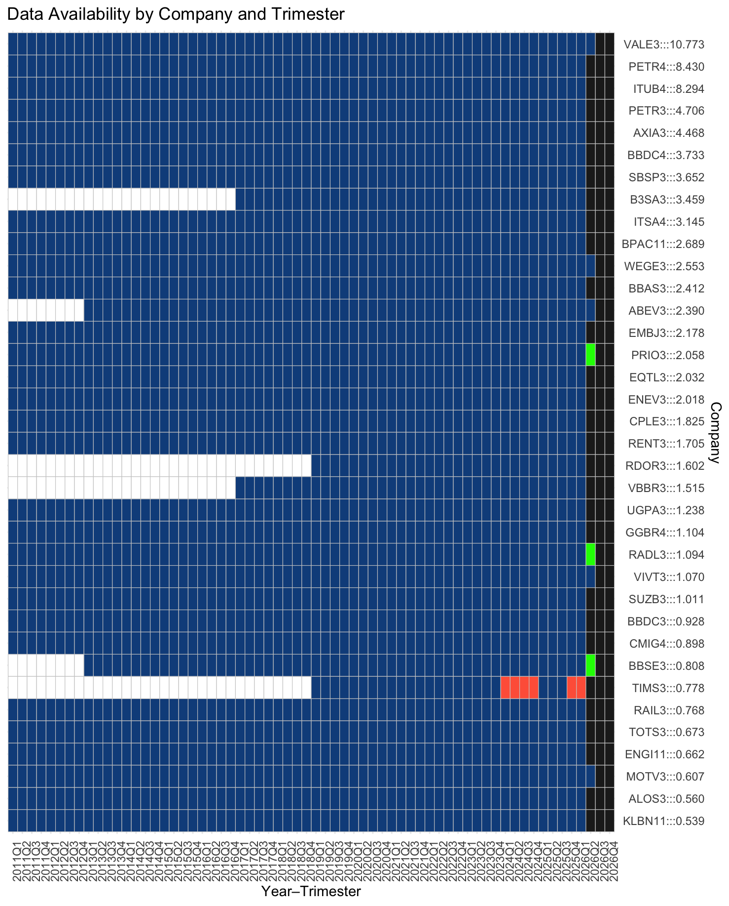

---
format:
  html:
    toc: true
    toc-depth: 2
    code-fold: show
    code-summary: "code"
    theme: 
      light: cosmo # litera
      dark: slate  #
execute:
  echo: true
  warning: false
  message: false
---


<style>

.page-header {
    display: flex;
    align-items: center;
    gap: 12px;
    margin: 20px 0 30px 0;
}

.page-header h2 {
    margin: 0;
    line-height: 1.1;
}

.back-button {
    font-size: 2rem;
    text-decoration: none;
    color: inherit;
    line-height: 1;
    display: flex;
    align-items: center;
    justify-content: center;
    transition: 0.2s;
}

.back-button:hover {
    color: #0d6efd;
    transform: translateX(-2px);
}

</style>

<div class="page-header">

<a class="back-button" href="index.html" title="Back to Home">
    &#10094;
</a>


<h2>As Engrenagens</h2>

</div>

::: {.callout-note collapse="true"}
#### Ferramentas

Este espaço é destinado a quem deseja ver a implementação técnica sem a
camada didática. 

Para detalhes sobre funções específicas do R, consulte
o [Tidyverse Help](https://www.tidyverse.org/help/).

```{r echo=FALSE, warning=F, message=FALSE}
data_mart_path <- here::here("data","mart")
healthcheck_validation <- T
purrr::walk(list.files(here::here("R","dal"),full.names=TRUE),source)
```
:::

Loading objects...

```{r}
ontology <- DAL_Ontology$new() ; quantamental <- DAL_Quantamental$new()
```

Listar os participantes, assets:

```{r}
ontology$get_assets() |> sample(15)
```

Setores:

```{r}
ontology$get_sectors()
```

Índices:

```{r}
data.frame(
  `Índice` = c("IBOV_60", "IBOV_90", "IBOV", "SMLL"),
  Participantes = c(
    ontology$get_b3_index()$IBOV_60 |> nrow(),
    ontology$get_b3_index()$IBOV_90 |> nrow(),
    ontology$get_b3_index()$IBOV |> nrow(),
    ontology$get_b3_index()$SMLL |> nrow()
  ),
  Descrição = c(
    "60% do índice IBOV",
    "90% do índice IBOV",
    "Índice Bovespa completo",
    "Índice Small Caps"
  )
)
```

## Features:

```{r}
library(gt)
df <- quantamental$assets(c("VALE3","BRAP4","CMIN3","CSNA3","GGBR4","USIM5"))
df |> filter(date>=max(date)-365) |> group_by(asset) |> mutate(var_12M=(last(close)/first(close))-1) |> filter(date==max(date)) |> ungroup() |> mutate(marketcap=marketcap*1000,Net_Profit_12M=Net_Profit_12M*1000) |> 
  select(asset,Report_Date,marketcap,Net_Profit_12M,roe,var_12M,pe) |> 
  arrange(desc(marketcap)) |> 
  gt() |> 
  cols_label(
    asset = "Ticker",
    Report_Date = "Last Report",
    marketcap = "Marketcap",
    Net_Profit_12M = "Lucro.12M",
    pe = "P/L",
    roe = "ROE",
    var_12M = "Var.12M"
  ) |>
  fmt_date(Report_Date,date_style="MMMd") |>
  fmt_number(c(marketcap,Net_Profit_12M),decimals=1,suffixing=T) |> 
  fmt_number(pe,decimals=2) |>
  fmt_percent(c(roe,var_12M),decimals=1) |>
  tab_header(
    title = "Features disponíveis pelo modelo",
    subtitle = "Cada linha representa uma empresa e cada coluna uma feature."
  )
```


## Plot Time Series


## Telemetria: Monitorando a Saúde dos Dados

Para um analista quantamental, o maior risco não é um modelo errado, mas um dado corrompido ou ausente. A seção de **Telemetria** atua como o painel de controle (dashboard) do nosso ecossistema, garantindo que a ontologia esteja íntegra antes de qualquer tomada de decisão.

#### Disponibilidade de Relatórios Trimestrais

Uma das métricas vitais da telemetria é a **densidade de cobertura dos balanços**. Como cada empresa listada deve, obrigatoriamente, publicar um relatório a cada trimestre. Lacunas nesse mapa podem indicar desde atrasos na divulgação pela empresa até falhas no processo de extração (scraping).

O gráfico abaixo apresenta a matriz de disponibilidade de relatórios. Cada linha representa uma empresa e cada coluna um trimestre fiscal. O preenchimento em azul indica que o dado foi capturado e integrado com sucesso.



> **Nota para Devs:** No backend, essa telemetria é gerada cruzando o `get_assets()` com a contagem de entradas únicas na tabela de fundamentos. Se `count(reports) < expected_quarters`, um alerta é disparado no log do sistema.


Este espaço é destinado a quem deseja ver a implementação técnica sem a
camada didática. Para detalhes sobre funções específicas do R, consulte
o [Tidyverse Help](https://www.tidyverse.org/help/).
