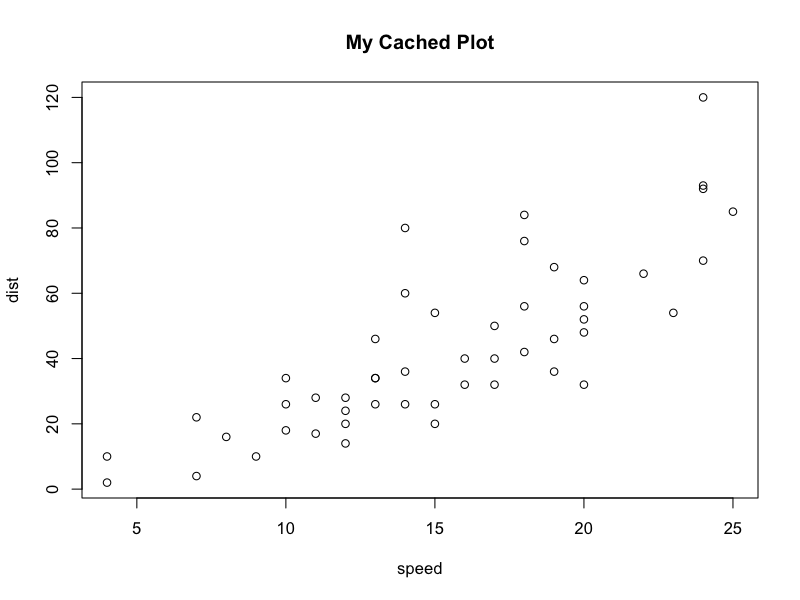

::: {.callout-note collapse="true"}
## Pré-requisitos

Instalar o R versão posterior a `r paste0(R.version$major, ".", R.version$minor)` <br> <https://cran.r-project.org/bin/windows/base/>

E a IDE RStudio <br> <https://docs.posit.co/ide/user/#rstudio-ide-oss-downloads>

Tidyverse package [link](https://tidyverse.org) <br> \> `install.packages("tidyverse")`
:::

::: {.callout-tip collapse="true"}
## O que é?

*Quanta.mental* <br>

\- **Quantitativo:** refere-se à análise quantitativa — modelos matemáticos, algoritmos, estatística e processamento de dados.

\- **Fundamental:** refere-se à análise fundamentalista tradicional — avaliação de balanços patrimoniais, saúde do negócio, governança e contexto de mercado.

### Origem e Contexto Histórico

A palavra começou a ganhar forte tração em Wall Street por volta de 2015–2017, em resposta a uma mudança estrutural no mercado financeiro global:

- A explosão dos Big Data e IA: Os gestores fundamentalistas tradicionais (como os seguidores da escola de Warren Buffett) perceberam que a análise manual de balanços e relatórios já não era suficiente diante do volume massivo de dados alternativos (como dados de satélite, navegação na web e transações de cartão de crédito).

- Os limites dos algoritmos puros: Por outro lado, os fundos puramente quantitativos (quant, pioneiros como Jim Simons) enfrentavam desafios com eventos imprevisíveis (black swans) e "ruídos" estatísticos onde o julgamento humano e a visão macro ainda se faziam indispensáveis.

A gestão quantamental propõe o "melhor dos dois mundos": o poder computacional analisa de dados para gerar hipóteses e identificar oportunidades, enquanto o faro e julgamento do analista humano valida essas teses e compreende as nuances do negócio que a matemática pura não consegue capturar.
:::

**Quantamental** é um neologismo no mercado financeiro combinando dois conceitos: quantitativo (análise estatística) e fundamental (dados fundamentalistas referentes aos negócios da empresa).

A proposta desse projeto é unir essas duas visões por meio de uma **ontologia do mercado financeiro**, organizando informações sobre empresas, setores e índices da B3 de forma simples para análise em R.

::: {.callout-tip collapse="true"}
## Veja mais...

Uma ontologia pode ser entendida como um **mapa de conhecimento**. Em vez de trabalhar apenas com tabelas isoladas, ela organiza como os elementos do mercado financeiro se relacionam.

Por exemplo:

- uma empresa pertence a um setor;
- um setor reúne diversas empresas;
- uma empresa pode fazer parte de um ou mais índices da B3;
- empresas do mesmo setor tendem a possuir características semelhantes.

Essa organização facilita análises exploratórias, construção de modelos quantitativos e geração de insights para investimento.

```{r}
#| echo: false
data_mart_path <- file.path("..","data","mart")
healthcheck_validation <- F
purrr::walk(list.files("../R/dal",full.names=TRUE),source)
ontology <- DAL_Ontology$new()
```
:::

## Participantes do projeto

```{r setup, echo=FALSE, include=FALSE}
n_sample_assets <- 8
```

Os participantes correspondem aos ativos cadastrados, empresas que serão analisadas nesse estudo. Aqui abaixo segue uma lista de amostragem com `r n_sample_assets` ativos.

```{r}
ontology$get_assets() |> sample(n_sample_assets)
```

## Setores

A ontologia também organiza os setores econômicos utilizados para agrupar os ativos.

```{r}
ontology$get_sectors()
```

## Índices B3

Os índices da B3 agrupam empresas segundo diferentes critérios. A partir dos índices é possível fazer novas composições. A tabela abaixo mostra quantos ativos estão presentes em cada índice disponível na ontologia.

```{r}
#| echo: false
data.frame(
  Participantes = c(
    ontology$get_b3_index()$IBOV_60 |> nrow(),
    ontology$get_b3_index()$IBOV_90 |> nrow(),
    ontology$get_b3_index()$IBOV |> nrow(),
    ontology$get_b3_index()$SMLL |> nrow()
  ),
  Índice = c("IBOV_60", "IBOV_90", "IBOV", "SMLL"),
  Descrição = c(
    "60% do índice IBOV",
    "90% do índice IBOV",
    "Índice Bovespa completo",
    "Índice Small Caps"
  )
)
```

### O que representam esses índices?

- **IBOV**: principal índice da bolsa brasileira B3, reunindo as ações mais negociadas.
- **IBOV_90**: subconjunto de aproximadamente 90% da composição do IBOV.
- **IBOV_60**: Bluechips, aproximadamente 60% da composição do IBOV.
- **SMLL**: índice composto por empresas classificadas como Small Caps.

::: callout-note
Ao longo deste tutorial utilizaremos esses conjuntos de empresas para explorar os dados da ontologia e entender como as relações entre empresas e setores podem auxiliar em análises financeiras.
:::

## Similaridade

Escrever sobre o conceito de similaridade entre empresas.

## Próximos passos

Referências para outros arquivos scripts .R, .Rmd ou tutoriais

## Referências

Como criar um arquivo Rmd R Markdown? [link](https://rmarkdown.rstudio.com/)

::

TESTING AREA

::


```{r generate-plot, echo=FALSE, include=FALSE}
# Create and save plot if file doesn't exist
# if (file.exists("my_plot.png")) {
  png("html/my_plot.png", width = 800, height = 600, res = 100)
  
  # Your plotting code here
  plot(cars, main = "My Cached Plot")
  
  dev.off()
# }
```

```{r load-plot, echo=FALSE, out.width="80%"}
if (file.exists("html/my_plot.png")) 
```
