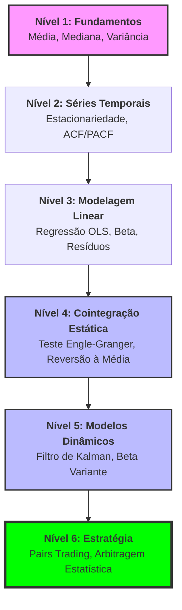

```{=html}
<style>

.page-header {
    display: flex;
    align-items: center;
    gap: 12px;
    margin: 20px 0 30px 0;
}

.page-header h2 {
    margin: 0;
    line-height: 1.1;
}

.back-button {
    font-size: 2rem;
    text-decoration: none;
    color: inherit;
    line-height: 1;
    display: flex;
    align-items: center;
    justify-content: center;
    transition: 0.2s;
}

.back-button:hover {
    color: #0d6efd;
    transform: translateX(-2px);
}

</style>
```

::: page-header
<a class="back-button" href="index.html" title="Back to Home"> ❮ </a>

<h2>Análise de Séries Temporais</h2>
:::

No universo quantamental, a análise de dados não se limita a um único
ponto no tempo. Acompanhar a evolução de indicadores ao longo do tempo,
ou séries temporais, é fundamental para entender tendências, ciclos e a
resiliência de empresas e mercados.

## Indicadores

Neste capítulo, exploraremos como visualizar e interpretar o indicador
Preço/Lucro (P/L) sob a ótica temporal, tanto para uma empresa
individual quanto para um índice de mercado como o IBOV.

::: {.callout-note collapse="true"}
#### Loading objects...

```{r}
#| echo: false
data_mart_path <- here::here("data","mart")
healthcheck_validation <- F
purrr::walk(list.files(here::here("R","dal"),full.names=TRUE),source)
```

```{r}
ontology <- DAL_Ontology$new()
quantamental <- DAL_Quantamental$new()
```
:::

```{r echo=FALSE}
time_series_sample_1 <- "ITUB4"
```

## Preço e Lucro: O Caso `r time_series_sample_1`

O Preço/Lucro (P/L) é um dos múltiplos de *valuation* mais utilizados,
indicando quantos anos de lucro a empresa levaria para "pagar" seu preço
de mercado. Para setores mais estáveis, como o bancário ou serviços
públicos no Brasil, o P/L tende a apresentar uma volatilidade menor,
refletindo a previsibilidade de seus resultados.

Vamos observar a evolução do P/L de `r time_series_sample_1` ao longo
dos últimos anos. Isso nos permite identificar o patamar histórico de
*valuation* da empresa e compará-lo com o momento atual.

```{r load-pe_itub4-plot, echo=FALSE, out.width="80%"}
  time_series_sample_1_png <- file.path("plots",paste0("pe_",time_series_sample_1,".png"))
  if (file.exists(time_series_sample_1_png))
    knitr::include_graphics(time_series_sample_1_png)
```

::: {.callout-note collapse="true"}
#### Código para gerar esse gráfico...

```{r}
  library(tidyverse)
  start_time=Sys.time() ; df <- quantamental$asset(time_series_sample_1) ; d <- difftime(Sys.time(), start_time, units = "secs") ; cat(sprintf(paste0("Tempo para carregar os dados de ",time_series_sample_1," : %.5f %s"), as.numeric(d), attr(d, "units")))
  png(time_series_sample_1_png, width = 400, height = 300, res = 100)
  plot <- df |> #filter(year(date)>=2025) |> 
      ggplot(aes(date,pe))+
      geom_hline(yintercept=0,linetype=2,color="tomato",alpha=.5)+
      geom_line()+ylab("P/L")+xlab(df$asset[1])+
      # geom_line(aes(y=Net_Profit_12M/max(Net_Profit_12M,na.rm=T)*max(pe,na.rm=T)),color="gold4",alpha=.3)+
      #geom_line(aes(y=         close/max(         close,na.rm=T)*max(pe,na.rm=T)),color="gold2",alpha=.5)+
      theme_minimal()
  plot(plot)
  dev.off()
```
:::

::: {.callout-tip collapse="true"}
#### Interpretação do P/L

Um P/L em patamares historicamente baixos pode indicar que a ação está
subvalorizada, enquanto um P/L elevado pode sugerir que o mercado tem
altas expectativas de crescimento futuro ou que a ação está
sobrevalorizada. A estabilidade do P/L em setores mais defensivos
reflete a natureza mais previsível de seus lucros e a menor
sensibilidade a ciclos econômicos extremos, em comparação com setores
mais cíclicos.
:::

## P/L do IBOV: Por que a Mediana Importa?

Analisar o P/L de um índice como o IBOV é mais complexo do que para uma
única empresa. O IBOV é composto por dezenas de empresas, e a média
simples do P/L pode ser facilmente distorcida por *outliers* – empresas
com lucros muito baixos (P/L altíssimo) ou até prejuízo (P/L negativo,
que não faz sentido para a média).

É aqui que a **mediana** se torna uma ferramenta poderosa. A mediana
representa o valor central de uma distribuição, sendo menos sensível a
valores extremos. Ao calcular o P/L mediano do IBOV, obtemos uma visão
mais realista do *valuation* geral do mercado, sem as distorções
causadas por empresas atípicas.

::: {.callout-note collapse="true"}
#### Código para gerar esse gráfico...

```{r}
  start_time=Sys.time() ; assets_from_IBOV_df <- quantamental$query() |>  
    filter(asset %in% ontology$get_b3_index()$IBOV$asset) |> 
    collect() |> 
    group_by(date) |> summarise(median_pe=median(pe,na.rm=T),N=n()) ; d <- difftime(Sys.time(), start_time, units = "secs") ; cat(sprintf(paste0("Tempo para carregar os dados do índice IBOV : %.5f %s"), as.numeric(d), attr(d, "units")))
  start_time=Sys.time() ; IBOV_SD_df <- quantamental$query() |>  
    filter(asset %in% ontology$get_b3_index()$IBOV$asset) |> 
    collect() |> 
    group_by(date) |> summarise(median_ibov=median(pe,na.rm=T)) ; d <- difftime(Sys.time(), start_time, units = "secs") ; cat(sprintf(paste0("Tempo para carregar desvio-padrão histórico de IBOV: %.5f %s"), as.numeric(d), attr(d, "units")))
```

```{r}
time_series_sample_1_index_png <- file.path("plots",paste0("pe_",time_series_sample_1,"_index.png"))
png(time_series_sample_1_index_png, width = 400, height = 300, res = 100)
plot <- 
  assets_from_IBOV_df |> 
  left_join(IBOV_SD_df,by="date") |> mutate(mean_pe_ibov=mean(median_ibov,na.rm=T),sd_pe_ibov=sd(median_ibov,na.rm=T)) |> 
  mutate(mean_pe=mean(median_pe,na.rm=T),sd_pe=sd(median_pe,na.rm=T)) |> 
  filter(year(date)>=2022) |>
  ggplot(aes(date,median_pe))+geom_line(aes(y=mean_pe),color="dodgerblue1",alpha=.5,linewidth=2)+
  geom_line(aes(y=mean_pe_ibov),color="gray",alpha=.8,linewidth=3)+
  geom_line(aes(y=mean_pe_ibov-sd_pe_ibov*1),color="gray",alpha=.5,linewidth=3)+
  geom_line(aes(y=mean_pe_ibov+sd_pe_ibov*1),color="gray",alpha=.5,linewidth=3)+
  geom_line(aes(y=mean_pe_ibov-sd_pe_ibov*2),color="gray",alpha=.3,linewidth=3)+
  geom_line(aes(y=mean_pe_ibov+sd_pe_ibov*2),color="gray",alpha=.3,linewidth=3)+
  geom_line(color="dodgerblue1")+ylab("P/L do Ibovespa")+
  theme_minimal()+scale_x_date(date_breaks="1 year",date_labels="%Y")+theme(axis.text.x=element_text(angle=90,vjust=.5,hjust=1))
plot(plot)
dev.off()
```

#### Vantagens da Mediana para Índices

Em mercados voláteis ou com empresas em diferentes estágios de
maturidade, a mediana oferece uma medida de tendência central mais
estável e representativa. Ela evita que uma única empresa com um P/L
extremamente alto ou baixo distorça a percepção do *valuation* do índice
como um todo, fornecendo um *benchmark* mais confiável para comparação.
:::

```{r load-pe-index-plot, echo=FALSE, out.width="80%"}
if (file.exists(time_series_sample_1_index_png))
  knitr::include_graphics(time_series_sample_1_index_png)
```

## Próximos Passos

- <a href="time_series_cointegration.html"> **Cointegração** link </a>: Evolua da análise
  descritiva básica para a modelagem preditiva avançada. Comece
  dominando **conceitos de estacionariedade** e autocorrelação (funções
  ACF/PACF), avance para regressões lineares simples aplicadas ao tempo
  e, em seguida, explore regressões dinâmicas que incorporam variáveis
  externas (ex: impacto da Selic no P/L). O estágio final desta jornada
  é a implementação de Modelos de Espaço de Estados, utilizando o
  **Filtro de Kalman** para estimar parâmetros que mudam ao longo do
  tempo, permitindo que o seu modelo quantamental se adapte
  automaticamente a novas condições de mercado sem a necessidade de
  janelas fixas de rolagem (rolling windows).

::: {.callout-tip collapse="true"}
#### Cointegração

Podemos afirmar que essa jornada estatística é o **alicerce
indispensável** para entender a cointegração de forma profunda e não
apenas como uma "fórmula pronta".

### 1. A Escada da Cointegração

Para entender a cointegração (que é, simplificadamente, quando dois
ativos "caminham juntos" no longo prazo, apesar de flutuações curtas),
você precisa obrigatoriamente passar por esses degraus: \*
**Estacionariedade:** Você não consegue entender cointegração sem saber
o que é uma série estacionária. A cointegração é, por definição, a busca
por uma combinação linear de duas séries não-estacionárias que resulte
em uma **série estacionária**. \* **Regressão Linear:** O "Hedge Ratio"
(a proporção de um ativo em relação ao outro) é o coeficiente $\beta$ de
uma regressão. Se você não domina a regressão, não entende como o modelo
tenta equilibrar os dois ativos.

### 2. O Salto para a Cointegração Dinâmica

A maioria dos tutoriais para em testes estáticos (como Engle-Granger).
Porém, no mercado real, a relação entre duas empresas (ex: Itaú e
Bradesco) muda. É aqui que o **Filtro de Kalman** se torna o "chefe
final": \* Em vez de um $\beta$ fixo, o Filtro de Kalman permite um
$\beta$ variante no tempo. \* Isso significa que você está fazendo
**Cointegração Dinâmica**, que é o estado da arte para estratégias de
*Pairs Trading*.

## Mapa da Jornada: Do Básico à Cointegração Dinâmica

Abaixo apresentamos a trilha de aprendizado sugerida para dominar a
análise quantamental de séries temporais. Esta jornada é incremental:
cada nível fornece as ferramentas matemáticas necessárias para o próximo
passo.

### Visualização da Jornada



### O que esperar de cada nível?

1.  **Fundamentos:** Entender a distribuição dos dados e por que a
    mediana é mais robusta que a média em indicadores de valuation.
2.  **Séries Temporais:** Aprender a identificar se uma série é
    "estacionária" (se comporta de forma previsível ao redor de uma
    média) ou se possui raiz unitária.
3.  **Modelagem Linear:** Estimar a relação de dependência entre dois
    ativos (o famoso Beta do Hedge).
4.  **Cointegração Estática:** O primeiro grande marco. Encontrar pares
    de ativos que, embora flutuem, mantêm uma relação de equilíbrio de
    longo prazo.
5.  **Modelos Dinâmicos (Filtro de Kalman):** A sofisticação técnica.
    Permitir que o modelo aprenda que a relação entre os ativos muda com
    o tempo, ajustando o Beta dinamicamente.
6.  **Estratégia:** A aplicação prática em portfólios reais, utilizando
    a arbitragem estatística para lucrar com desvios temporários do
    equilíbrio.

> **Dica Quantamental:** A cointegração não é apenas matemática; ela
> deve ser validada pela **Ontologia**. Um par cointegrado
> estatisticamente só é confiável se houver uma razão fundamentalista
> (mesmo setor, mesma cadeia de suprimentos) para eles caminharem
> juntos.
:::

- **Integração com os grupos de ativos:** Conecte os dados de P/L e
  outros múltiplos com entre ativos similares.

::: {.callout-tip collapse="true"}
#### Conexão com a Ontologia

O caminho estatístico dá a "ferramenta", mas a **Ontologia** e a
**Similaridade** (que discutimos antes) dão o "alvo". A estatística diz
*como* operar, e a ontologia diz *quem* operar (escolhendo pares que
fazem sentido fundamentalista).

- Análise de grupos de índices

- **Análise de Setores:** Compare a evolução do P/L mediano de
  diferentes setores da B3 para identificar quais estão mais "caros" ou
  "baratos" historicamente.
:::

- **Bandas de Valuation:** Crie bandas de *valuation* (ex: P/L +/- 1
  desvio padrão) para identificar quando um ativo ou índice está em
  patamares extremos de *valuation*.


## Referências

Este tutorial se baseia em conceitos de finanças quantitativas e análise
fundamentalista. Para aprofundar nos temas abordados, sugerimos as
seguintes leituras:

- Time Series Notebook <a href="time_series_nb.html"> link </a>